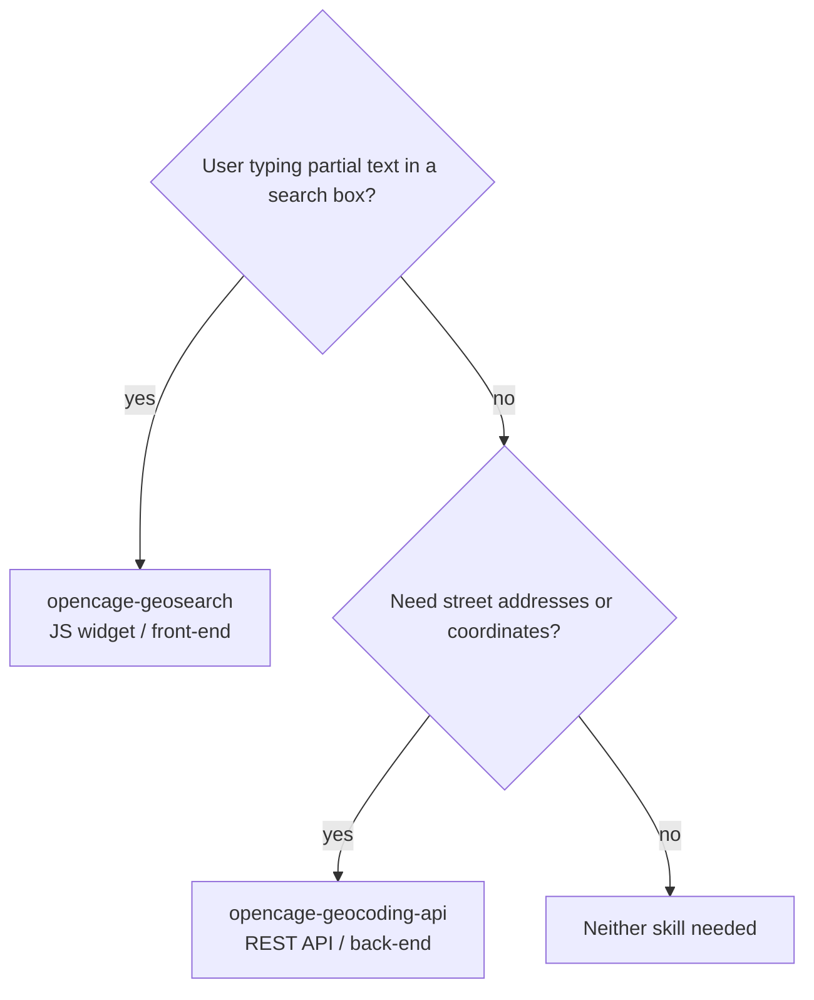

# opencage-skills

Agent skills for working with OpenCage geocoding and geosearch services. These skills give any AI coding agent the context it needs to integrate with the OpenCage APIs correctly — including endpoint details, SDK usage patterns, error handling, and common pitfalls.

The skills are plain markdown files that work with any agent that can read documentation. First-class installation is provided for Claude Code via its plugin system.

## Skills

| Skill | Purpose |
|-------|---------|
| `opencage-geocoding-api` | Forward/reverse geocoding via the OpenCage REST API |
| `opencage-geosearch` | Geographic autosuggest/autocomplete JavaScript widget |

### Geocoding API skill

Use when you need forward geocoding (address to coordinates), reverse geocoding (coordinates to address), or help working with geocoding API responses. Covers Python, Node.js, Ruby, PHP, Java, Perl, and command-line usage.

Includes language-specific reference files:

| Reference | Description |
|-----------|-------------|
| `references/api-details.md` | Full API parameter and response reference |
| `references/python.md` | Python SDK usage |
| `references/nodejs.md` | Node.js SDK usage |
| `references/ruby.md` | Ruby SDK usage |
| `references/php.md` | PHP SDK usage |
| `references/java.md` | Java SDK usage |
| `references/perl.md` | Perl SDK usage |
| `references/commandline.md` | Command-line batch CSV processing |

### Geosearch skill

Use when you need geographic place autosuggest or autocomplete on a web page, or are integrating a location search widget with Leaflet, OpenLayers, or MapLibre.

## Installation

See [install.md](install.md) for setup instructions covering Claude Code, Gemini CLI, Codex, and other agents.

## Prerequisites

- An OpenCage account with the appropriate API key(s):
  - **Geocoding API key** (30 characters) — from [opencagedata.com/dashboard](https://opencagedata.com/dashboard)
  - **Geosearch key** (`oc_gs_...` format) — from [opencagedata.com/geosearch](https://opencagedata.com/geosearch) — this is a separate key from the geocoding API key

---

## About OpenCage GmbH

We run a worldwide [geocoding API](https://opencagedata.com/api) and [geosearch](https://opencagedata.com/geosearch) service based on open data. [Learn more about us](https://opencagedata.com/about).

We also organize [Geomob](https://thegeomob.com), a series of regular meetups for location-based service creators. If you like geo stuff, check out [the Geomob podcast](https://thegeomob.com/podcast/).
