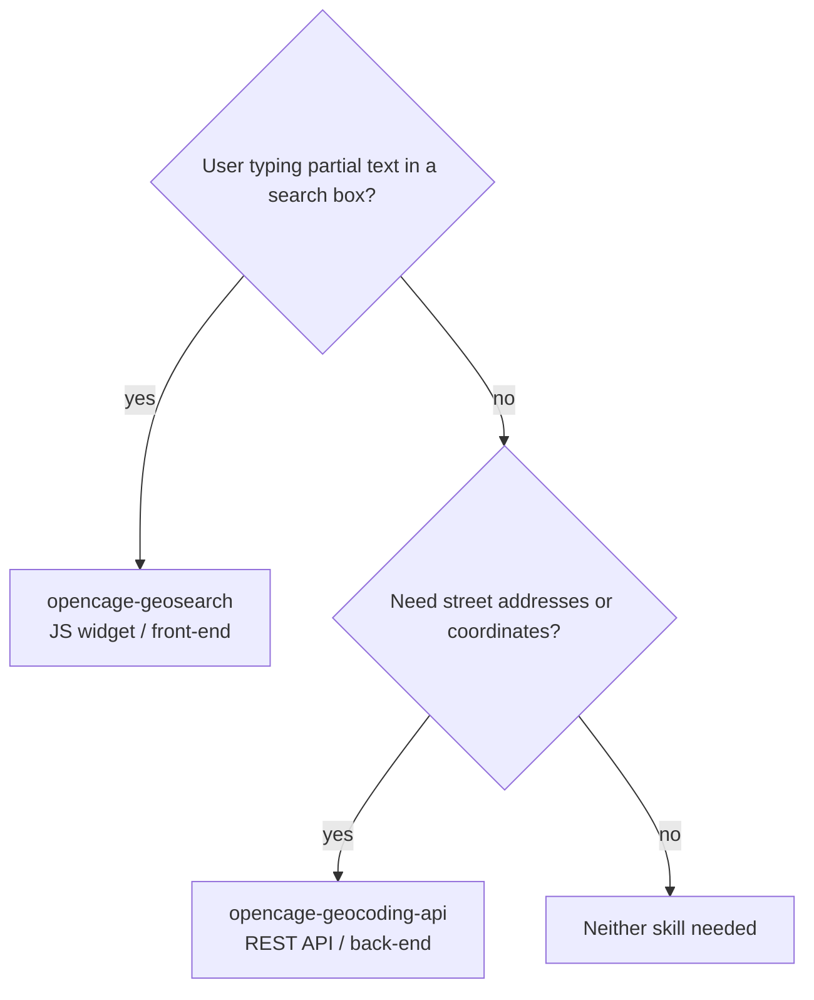

# Installing the OpenCage Agent Skills

This repository contains two Claude Code agent skills:

| Skill | Purpose |
|-------|---------|
| `opencage-geocoding-api` | Forward/reverse geocoding via the OpenCage REST API |
| `opencage-geosearch` | Geographic autosuggest/autocomplete JavaScript widget |

## Prerequisites

- [Claude Code](https://claude.ai/code) installed and configured
- An OpenCage account with the appropriate API key(s):
  - **Geocoding API key** (30 characters) — from [opencagedata.com/dashboard](https://opencagedata.com/dashboard)
  - **Geosearch key** (`oc_gs_...` format) — from [opencagedata.com/geosearch](https://opencagedata.com/geosearch) — this is a different key from the geocoding key

## Installation

### Option A: Install all skills globally (recommended)

Clone the repository directly into your personal Claude Code skills directory so the skills are available in every project:

```bash
git clone https://github.com/OpenCageData/opencage-skills.git ~/.claude/skills/opencage-skills
```

### Option B: Install a single skill globally

If you only need one skill:

```bash
# Geocoding API skill only
git clone --no-checkout https://github.com/OpenCageData/opencage-skills.git /tmp/opencage-skills
cd /tmp/opencage-skills && git checkout HEAD -- opencage-geocoding-api
cp -r opencage-geocoding-api ~/.claude/skills/
cd && rm -rf /tmp/opencage-skills
```

Or simply clone the full repo and copy the skill directory you want:

```bash
git clone https://github.com/OpenCageData/opencage-skills.git /tmp/opencage-skills
cp -r /tmp/opencage-skills/opencage-geocoding-api ~/.claude/skills/
# and/or
cp -r /tmp/opencage-skills/opencage-geosearch ~/.claude/skills/
rm -rf /tmp/opencage-skills
```

### Option C: Install at project level

To make the skills available only within a specific project:

```bash
mkdir -p /path/to/your/project/.claude/skills
cp -r opencage-geocoding-api /path/to/your/project/.claude/skills/
cp -r opencage-geosearch /path/to/your/project/.claude/skills/
```

### Option D: Keep skills up to date with a git submodule

Add this repository as a submodule so you can pull updates:

```bash
cd /path/to/your/project
git submodule add https://github.com/OpenCageData/opencage-skills.git .claude/skills/opencage-skills
```

Claude Code will discover the skills inside the submodule automatically.

## Verifying installation

Once installed, Claude Code will automatically load the relevant skill when you ask about geocoding or geosearch. You can also invoke them explicitly:

```
/opencage-geocoding-api
/opencage-geosearch
```

Run `/help` to confirm both skills appear in the available commands list.

## Permissions

The skills need to fetch documentation and make API calls to `opencagedata.com`. The `.claude/settings.local.json` files included in this repository grant the required permissions automatically when the skills are loaded from their directory. No manual permission setup is required.

## How the skills are triggered

Claude Code loads the appropriate skill automatically based on context:

- **`opencage-geocoding-api`** — triggered when you ask about forward/reverse geocoding, address lookup, coordinates, confidence scores, geocoding a CSV, or using the OpenCage API in Python, Node.js, Ruby, PHP, Java, or Perl.
- **`opencage-geosearch`** — triggered when you ask about place autocomplete, autosuggest on a web page, or integrating a location search widget with Leaflet, OpenLayers, or MapLibre.


