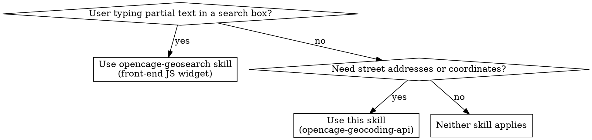

# OpenCage Geocoding API — General Concepts

The OpenCage Geocoding API converts addresses to coordinates (forward geocoding) and coordinates to addresses (reverse geocoding) via a REST endpoint returning JSON.


Endpoint:  https://api.opencagedata.com/geocode/v1/json
Auth:      key=YOUR-API-KEY (30 chars, from dashboard)
Forward:   q=Berlin,+Germany      → results[0].geometry.{lat,lng}
Reverse:   q=52.517,13.389        → results[0].formatted
Always:    no_annotations=1 unless you need annotations
Safe access: components fields are NOT guaranteed — use .get() / ?.
Status:    check status.code first (200 = OK, 402 = quota, 429 = rate limit)
```

## Forward Geocoding (address → coordinates)

Forward Geocoding returns a list of 0 or more results

## Reverse Geocoding (coordinates → address)

Reverse geocoding returns a list of 0 or 1 results (never more than one).

## API parameters

### Required API parameters

| Parameter | Brief Description | Example Usage |
|-----------|-------------------|---------------|
| `key` | Your unique 30-character alphanumeric API key, required on every request | `key=YOUR-API-KEY` |
| `q` | The query to geocode — either a latitude/longitude pair (reverse) or an address/placename (forward); must be URL-encoded | `q=52.5432379%2C13.4142133` (reverse) or `q=Berlin,+Germany` (forward) |

### Optional API parameters

Most-used: `no_annotations=1` (always set unless you need annotations), `countrycode`, `language`, `limit`, `bounds`, `proximity`. Full table in `references/api-details.md`.

## Getting an API Key

Register for a free trial account at **https://opencagedata.com/users/sign_up**. You can sign up with an email address, Google, or GitHub. No credit card is required for the free trial.

After confirming your email, your API key is available in the [OpenCage dashboard](https://opencagedata.com/dashboard). It is a 30-character string.

The free trial allows 2,500 requests per day (1 req/s max) while testing. Paid plans with higher limits are listed at **https://opencagedata.com/pricing**.

## API Endpoint

All requests are made via HTTPS GET to:
```
https://api.opencagedata.com/geocode/v1/json
```

A complete request URL looks like this:
```
https://api.opencagedata.com/geocode/v1/json?key=YOUR-API-KEY&q=Berlin%2C+Germany&limit=1&no_annotations=1
```

The `q` parameter must be URL-encoded. For reverse geocoding, pass coordinates as a comma-separated `lat,lng` pair:
```
https://api.opencagedata.com/geocode/v1/json?key=YOUR-API-KEY&q=51.5074%2C-0.1278&no_annotations=1
```

## Response Structure

Every response is a JSON object with this shape:
```json
{
  "status": {
    "code": 200,
    "message": "OK"
  },
  "total_results": 1,
  "results": [
    {
      "formatted": "Berlin, Germany",
      "geometry": {
        "lat": 52.5170365,
        "lng": 13.3888599
      },
      "bounds": {
        "northeast": { "lat": 52.6755087, "lng": 13.7611609 },
        "southwest": { "lat": 52.3382448, "lng": 13.0883450 }
      },
      "components": {
        "_type": "city",
        "country": "Germany",
        "country_code": "de",
        "city": "Berlin",
        "postcode": "10117"
      },
      "confidence": 2,
      "annotations": { }
    }
  ]
}
```

The fields you will use most often:

| Field | Description |
|-------|-------------|
| `status.code` | HTTP-equivalent status code — check this first |
| `total_results` | Number of results returned (0 if no match) |
| `results[n].geometry.lat` / `.lng` | The coordinates (forward geocoding primary output) |
| `results[n].formatted` | Human-readable address string |
| `results[n].components` | Structured address fields (country, city, postcode, etc.) |
| `results[n].components._type` | The type of place matched (e.g. `"city"`, `"road"`, `"building"`) |
| `results[n].confidence` | Bounding-box size score 0–10 (see Confidence Score section) |
| `results[n].bounds` | Northeast/southwest corners of the matched place |

**Never assume a field in `components` will be present** — the world is not uniform and many fields are location-dependent. Always use safe/optional access patterns (e.g. `.get()` in Python, optional chaining `?.` in JavaScript).

## Error Handling

Check `status.code` in the response body — it mirrors the HTTP status code. Do not rely solely on the HTTP status code, as some network layers may obscure it.

| HTTP / status.code | Meaning | Action |
|--------------------|---------|--------|
| `200` | Success | Process results normally; check `total_results` — may be 0 |
| `400` | Bad request (invalid query or parameters) | Fix the input before retrying |
| `401` | Unauthorized — API key missing or malformed | Check the `key` parameter |
| `402` | Quota exceeded for the day | Wait until quota resets (midnight UTC) or upgrade plan |
| `403` | Key disabled or suspended | Contact OpenCage support |
| `404` | Invalid endpoint URL | Check the request URL |
| `429` | Too many requests — rate limit hit | Back off and retry after a short delay |
| `500` | Internal server error | Retry with exponential backoff |

The `status.message` field contains a human-readable description of the error and is useful for logging.

For `402` errors, free-trial and one-time purchase customers can check `rate.remaining` in the response to monitor quota before hitting the limit.

## API Rate Limits

Free trial: 2,500 req/day, 1 req/s. Subscription plans have no hard limit. The `rate` object is only present in responses for free-trial and one-time purchase plans — do not assume it exists. Full details and example in `references/api-details.md`.

## Annotations

By default every result includes an `annotations` object with supplementary data (timezone, currency, geohash, sun times, etc.) derived from the result's coordinates. **Always set `no_annotations=1` if you don't need them** — this reduces response size and improves latency. Full annotation list in `references/api-details.md`.

## Confidence Score

The confidence score (0–10) measures the **size of the bounding box** — it is **not** correctness. "Berlin, Germany" returns confidence 2 because Berlin is large, not because the result is wrong. Do not use it for ranking (results are already relevance-sorted). To identify place type, check `components["_type"]` instead. Full score table in `references/api-details.md`.

## Results Reflect the Real World — Structure Varies

**Never assume a field will be present.** Components and annotations vary by location — ocean coordinates have no country, remote islands have no city, `FIPS` codes only exist in the US, `NUTS` only in the EU. Always use safe access patterns.

## Common Mistakes

- **Assuming `components.city` exists** — ocean coordinates have no country, remote islands have no city. Always use safe access (`.get()`, `?.`, `getOrDefault`).
- **Forgetting `no_annotations=1`** — annotations roughly double response size. Always set this unless you specifically need timezone, currency, etc.
- **Treating confidence as correctness** — confidence 2 for "Berlin, Germany" doesn't mean the result is wrong. It means Berlin is geographically large. See the Confidence Score section.
- **Fuzzy-searching with the API** — querying `"par"` will NOT return "Paris, France". This API expects complete addresses. For type-ahead, use the `opencage-geosearch` skill.
- **Not checking `total_results`** — a 200 response can have zero results. Always check before accessing `results[0]`.
- **Hardcoding API keys** — use environment variables. See the language-specific reference files for patterns.

## What This API Is NOT

### Not browser geolocation
The OpenCage API does not determine a user's location from their device, browser, or GPS sensor. For that, use the browser's [`navigator.geolocation` API](https://developer.mozilla.org/en-US/docs/Web/API/Geolocation_API). OpenCage requires an explicit address or coordinate as input.

### Not IP geolocation
The API does not infer location from an IP address. It converts addresses to coordinates (or vice versa) — it has no concept of the caller's network location.

### Not location autosuggest / autocomplete
Forward geocoding expects a complete (or near-complete) address or place name. It does **not** do fuzzy or prefix matching — querying `"par"` will not return `"Paris, France"`. For type-ahead / autocomplete / autosuggest functionality, use the `opencage-geosearch` skill instead.

---

## Key Behaviors

- **Coordinate system:** All results use WGS 84 (EPSG:4326)
- **No fuzzy matching:** "Par" won't find Paris — validate/clean input first
- **Reverse geocoding:** Returns 0 or 1 result (never more); `limit` parameter is ignored
- **Result order:** Sorted by relevance, not confidence
- **No persistent IDs:** Results have no stable unique identifier across calls
- **Caching:** Consider caching results locally — the API terms allow it

## Test API Keys

Use these keys for testing error-handling code:

| Key | Simulates |
|-----|-----------|
| `6d0e711d72d74daeb2b0bfd2a5cdfdba` | 200 OK (normal response) |
| `4372eff77b8343cebfc843eb4da4ddc4` | 402 quota exceeded |
| `2e10e5e828262eb243ec0b54681d699a` | 403 key disabled |

Test query that always returns zero results: `q=NOWHERE-INTERESTING`

## Language-specific SDKs

The OpenCage Geocoding API is language-agnostic — it is a standard HTTPS REST API that can be called from any language or environment. For detailed parameter tables, annotations, confidence scores, and rate limits, see `references/api-details.md`. For language-specific usage, refer to the appropriate reference file:

- **Python** — `references/python.md`
- **Node.js / TypeScript** — `references/nodejs.md`
- **Ruby** — `references/ruby.md`
- **PHP** — `references/php.md`
- **Java** — `references/java.md`
- **Perl** — `references/perl.md`
- **Command line (batch CSV processing)** — `references/commandline.md`

Official tutorials for these and other languages are available at: https://opencagedata.com/tutorials

## Further Reading

- OpenCage Geocoding API documentation: https://opencagedata.com/api
- OpenCage Pricing: https://opencagedata.com/pricing
- OpenCage Forward Geocoding API Query Formatting Guide: https://opencagedata.com/guides/how-to-format-your-geocoding-query

